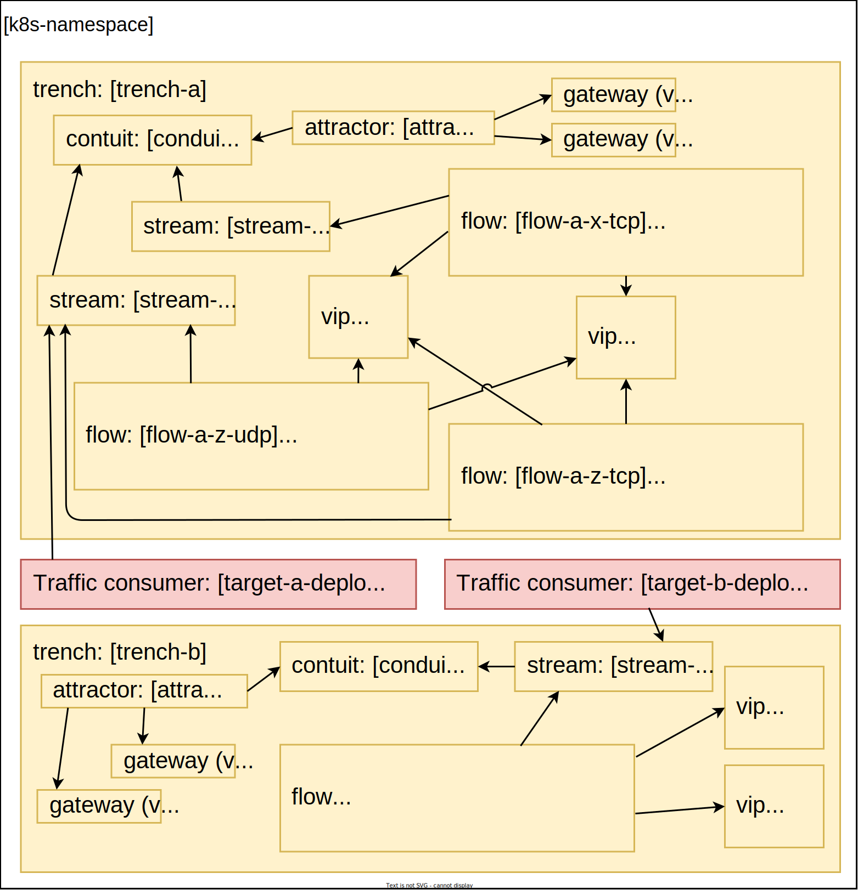

# Test

## E2E Tests

### Environment / Framework

#### Initial Deployment

The picture below shows the initial deployment that should be installed in a kubernetes cluster in order to execute the complete e2e test suite in dualstack. With only IPv4, elements containing `v6` are not used, and with only IPv6, elements containing `v4` are not used. Elements between `[]` are configurable via parameters, see the `Configuration` section. 



#### Configuration

| Name | Type | Description |
|---|---|---|
| traffic-generator-cmd | string | Command to use to connect to the traffic generator. All occurences of '{trench}' will be replaced with the trench name. |
| script | string | Path + script used by the e2e tests |
|  |  |  |
| k8s-namespace | string | Name of the namespace |
| target-a-deployment-name | string | Name of the target deployment |
| trench-a | string | Name of the trench |
| attractor-a-1 | string | Name of the attractor |
| conduit-a-1 | string | Name of the conduit |
| stream-a-I | string | Name of the stream |
| stream-a-II | string | Name of the stream |
| flow-a-z-tcp | string | Name of the flow |
| flow-a-z-tcp-destination-port-0 | int | Destination port 0 |
| flow-a-z-udp | string | Name of the flow |
| flow-a-z-udp-destination-port-0 | int | Destination port 0 |
| flow-a-x-tcp | string | Name of the flow |
| flow-a-x-tcp-destination-port-0 | int | Destination port 0 |
| vip-1-v4 | string | Address of the vip v4 number 1 |
| vip-1-v6 | string | Address of the vip v6 number 1 |
| target-b-deployment-name | string | Name of the target deployment |
| trench-b | string | Name of the trench |
| conduit-b-1 | string | Name of the conduit |
| stream-b-I | string | Name of the stream |
| vip-2-v4 | string | Address of the vip v4 number 2 |
| vip-2-v6 | string | Address of the vip v6 number 2 |
|  |  |  |
| stateless-lb-fe-deployment-name | string | Name of stateless-lb-fe deployment in `trench-a` |
| ip-family | string | IP Family |

For more details about each parameter, check the picture above in the `Initial Deployment` section.

#### Script

A bash script file must be passed as parameter of the e2e tests. The script is required to allowed the e2e tests to be run in every environment (Helm/Operator deployement...). The following functions has to be implemented in the script:

| Name | Description |
|---|---|
| init () error | Executed once before running the tests |
| end () error | Executed once after running the tests |
| configuration_new_ip () error | Executed just before running the `new-vip` test |
| configuration_new_ip_revert () error | Executed just after running the `new-vip` test |

### List of tests

| Name | Type | Description |
|---|---|---|
| TCP-IPv4 | IngressTraffic | Send traffic in `trench-a` with `vip-1-v4` as destination IP and `flow-a-z-tcp-destination-port-0` as destination port |
| TCP-IPv6 | IngressTraffic | Send traffic in `trench-a` with `vip-1-v6` as destination IP and `flow-a-z-tcp-destination-port-0` as destination port |
| UDP-IPv4 | IngressTraffic | Send traffic in `trench-a` with `vip-1-v4` as destination IP and `flow-a-z-udp-destination-port-0` as destination port |
| UDP-IPv6 | IngressTraffic | Send traffic in `trench-a` with `vip-1-v6` as destination IP and `flow-a-z-udp-destination-port-0` as destination port |
| MT-Switch | MultiTrenches | Disconnect a target from `target-a-deployment-name` from `trench-a` and connect it to `trench-b` |
| MT-Parallel | MultiTrenches | Send traffic in `trench-a` and `trench-b` at the same time |
| Scale-Down | Scaling | Scale down `target-a-deployment-name` |
| Scale-Up | Scaling | Scale up `target-a-deployment-name` |
| close-open | TAPA | Close `stream-a-I` in one of the target from `target-a-deployment-name` and re-open it |
| new-vip | Configuration | Configure `vip-2-v4` and `vip-2-v6` in `flow-a-z-tcp` and `attractor-a-1` |
<!-- TODO: | open | TAPA | Open `stream-a-II` in one of the target from `target-a-deployment-name` and close it | -->

### Steps (Kind)

1. Deploy Spire

```bash
kubectl apply -k docs/demo/deployments/spire
```

2. Deploy NSM

```bash
helm install docs/demo/deployments/nsm --generate-name --create-namespace --namespace nsm
```

3. Deploy Gateways

```bash
./docs/demo/scripts/kind/external-host.sh
```

4. Deploy trench-a

```bash
helm install deployments/helm/ --generate-name --create-namespace --namespace red --set trench.name=trench-a --set ipFamily=dualstack
```

5. Deploy trench-b

```bash
helm install deployments/helm/ --generate-name --create-namespace --namespace red --set trench.name=trench-b --set vlan.id=200 --set ipFamily=dualstack
```

6. Deploy target of trench-a

```bash
helm install examples/target/deployments/helm/ --generate-name --create-namespace --namespace red --set applicationName=target-a --set default.trench.name=trench-a
```

7. Deploy target of trench-b

```bash
helm install examples/target/deployments/helm/ --generate-name --create-namespace --namespace red --set applicationName=target-b --set default.trench.name=trench-b
```

8. Run e2e tests

```bash
make e2e
```
